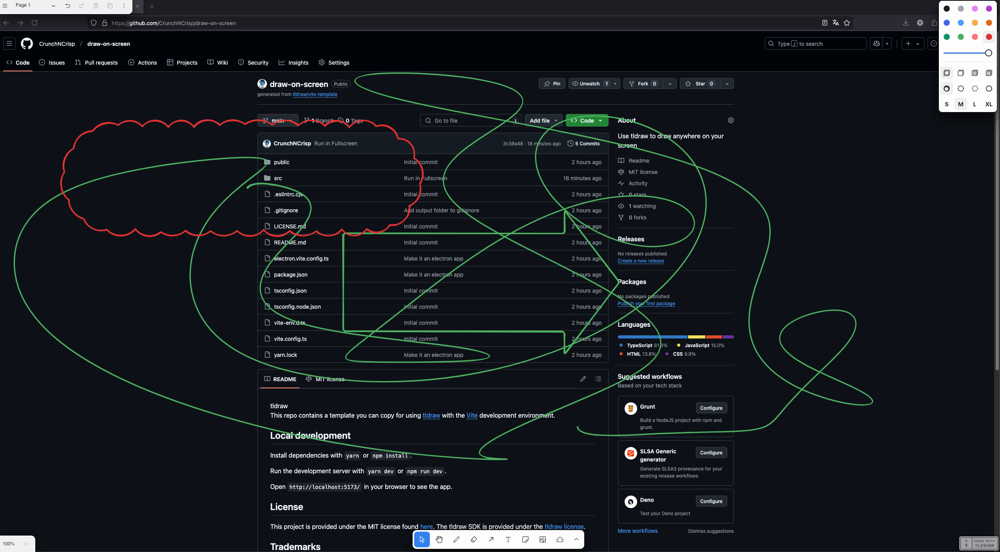

This repo is based on [tldraw](https://github.com/tldraw/tldraw) template with the [Vite](https://vitejs.dev/) development environment.

## What it does

This App Lets you draw anywhere on your screen / on your app.
Similar to EpicPen or gInk. Works with electron and thus on all platforms.

## Local development

Install dependencies with `yarn` or `npm install`.

Run the development server with `yarn dev` or `npm run dev`.

## License

This project is provided under the MIT license found [here](https://github.com/tldraw/vite-template/blob/main/LICENSE.md). The tldraw SDK is provided under the [tldraw license](https://github.com/tldraw/tldraw/blob/main/LICENSE.md).

## Trademarks

Copyright (c) 2024-present tldraw Inc. The tldraw name and logo are trademarks of tldraw. Please see  [trademark guidelines](https://github.com/tldraw/tldraw/blob/main/TRADEMARKS.md) for info on acceptable usage.

## Distributions

You can find tldraw on npm [here](https://www.npmjs.com/package/@tldraw/tldraw?activeTab=versions).